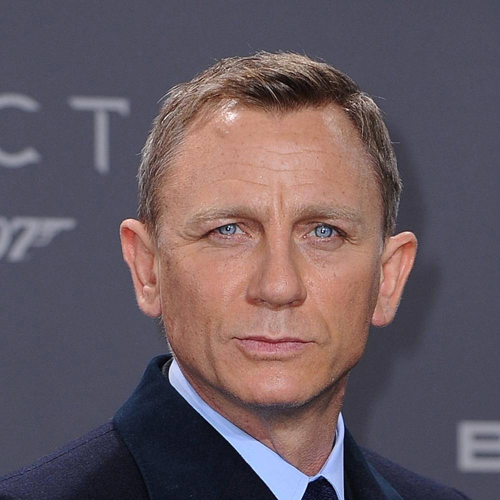
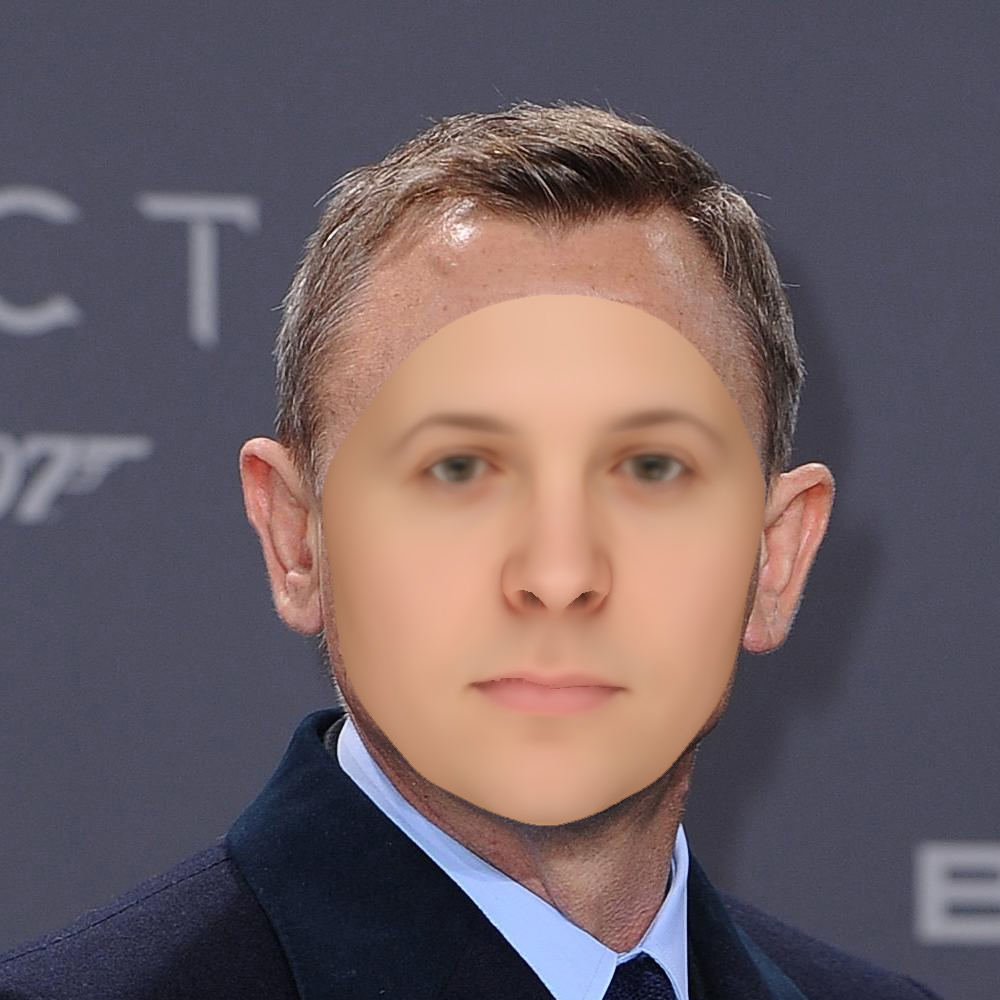
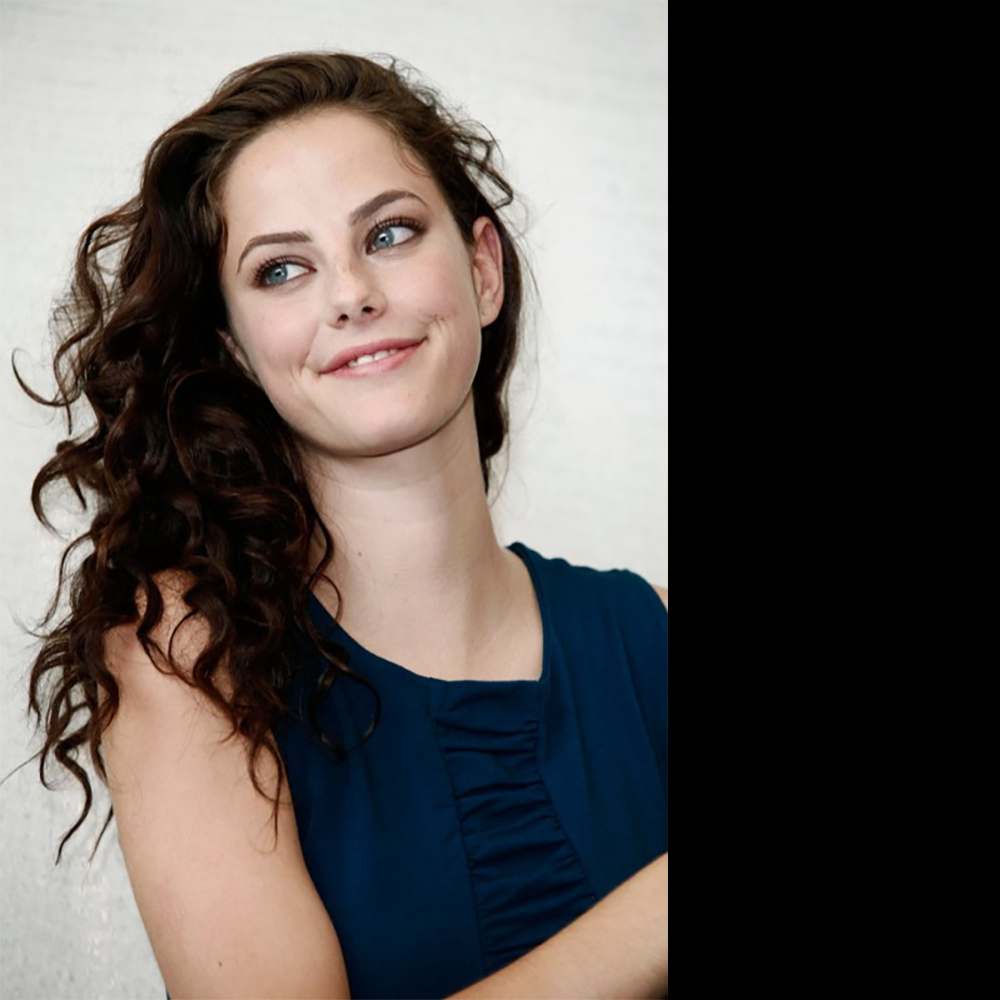
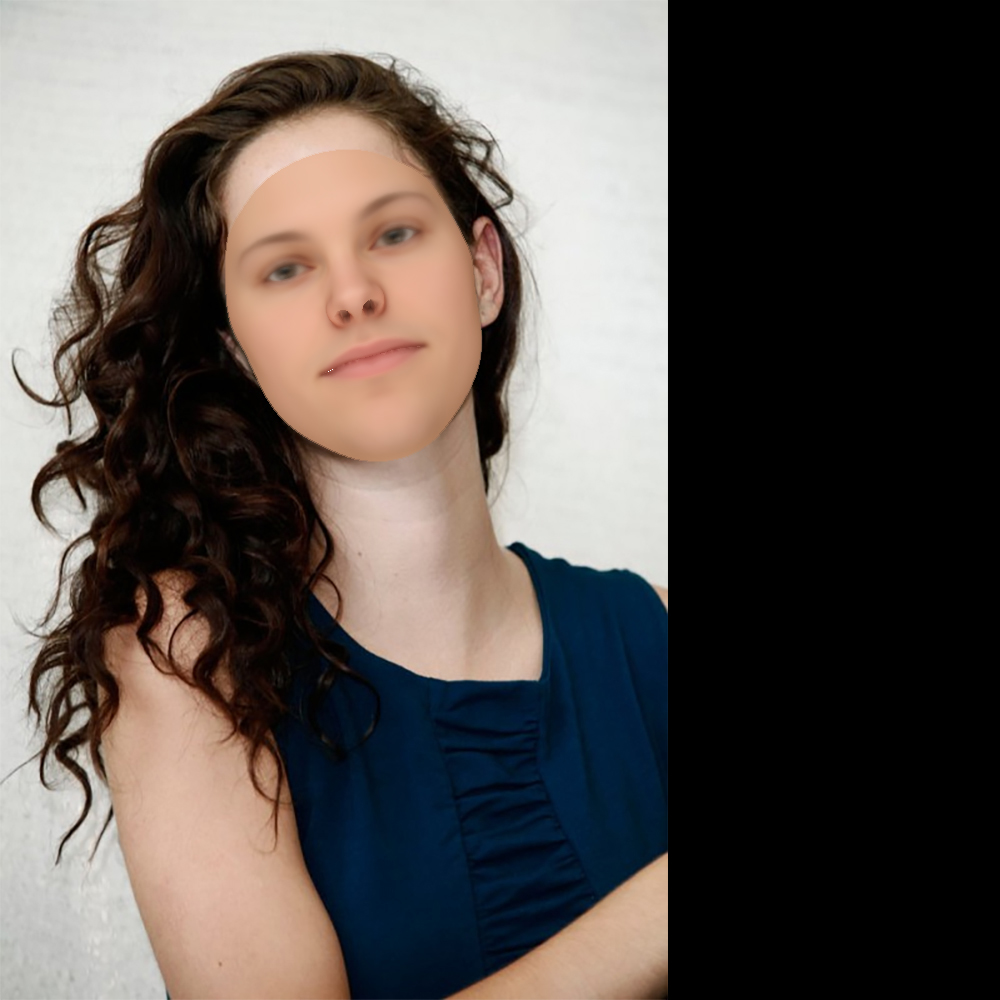
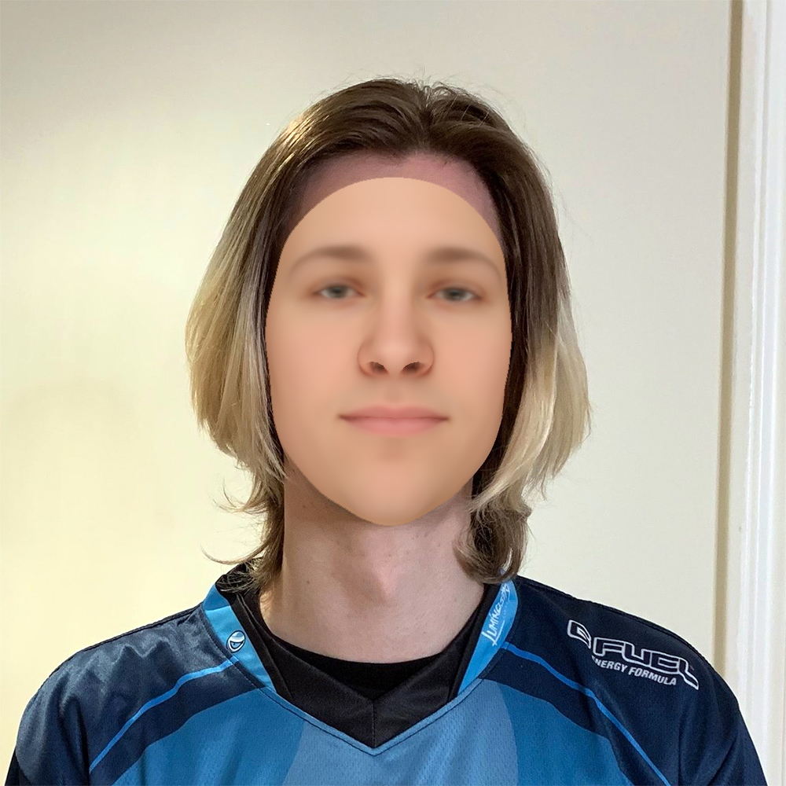
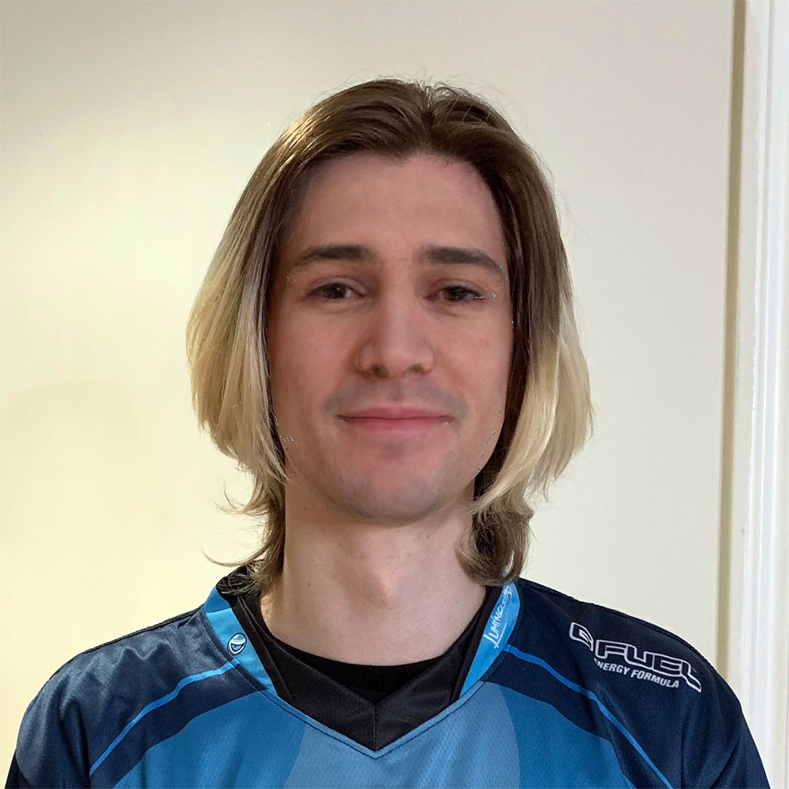
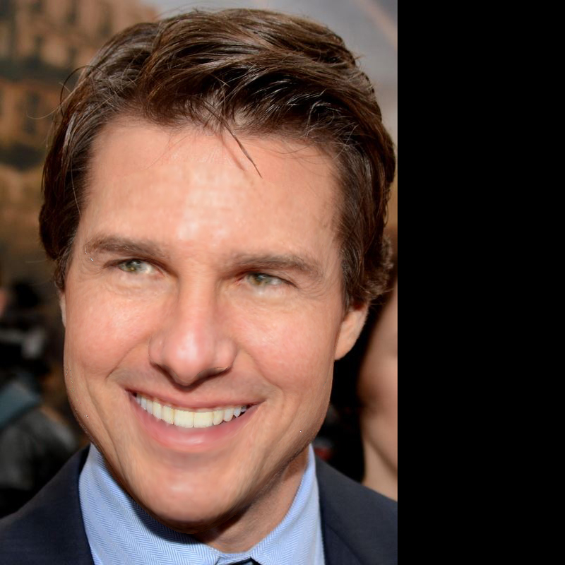
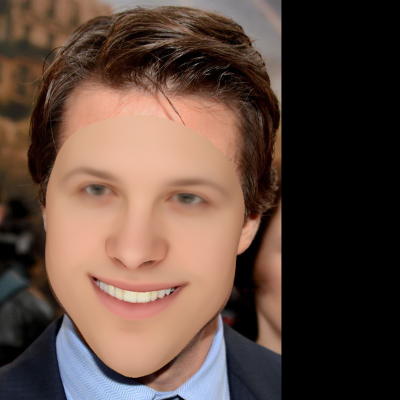
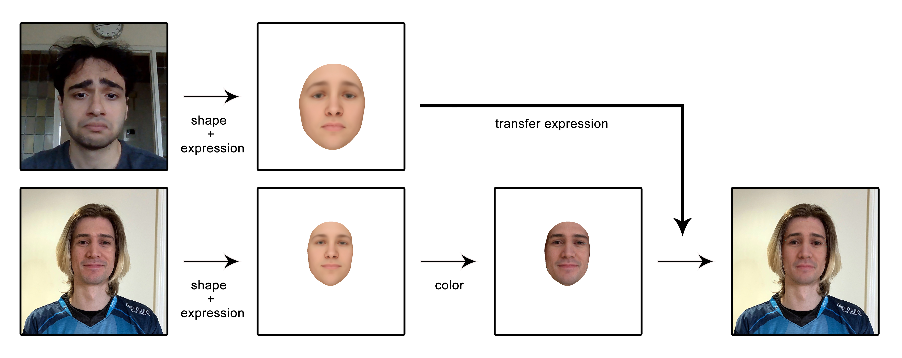

# 2D to 3D - Face Reconstruction

This project was implemented for 3D Scanning & Motion Capture (IN2354) course at TUM.

Our goal is to reconstruct a 2D face model based on a single RGB image. To accomplish this, we first detect facial landmarks on the RGB image. The Basel Face Model's landmarks are given by the model. After we detected the facial landmarks, we learn the weights of the parameters of the 3D model. We want to find the camera pose and the weights for the expression, shape and the color of the face. For this we use a sparse term based on the facial landmarks, a dense term based on the image color and a statistical regularizer.    

At the end our generated 2D model can be used to transfer the expression from a person in one image to a person in another image. The target image will then have the same facial expression of our input source image.

# Method
You can read the final report where explained our method [here](assets/paper.pdf).

# Results
Input Image             |  Face Fitting | Dense Optimization
:-------------------------:|:-------------------------:|:-------------------------:
  |   | 
  |   | 
  |   | 
  |   | 

# Expression Transfer

# How to build
You need to create a libs folder and install all required libraries there. You'll need to setup Eigen, Ceres, dlib, glog and OpenCV. You can then create the project using CMake (located in /src). 

# Team Members
* Berk Emre Saribas
* Min Ting Luong
* Philip Neugebauer
* Amine Bentellis